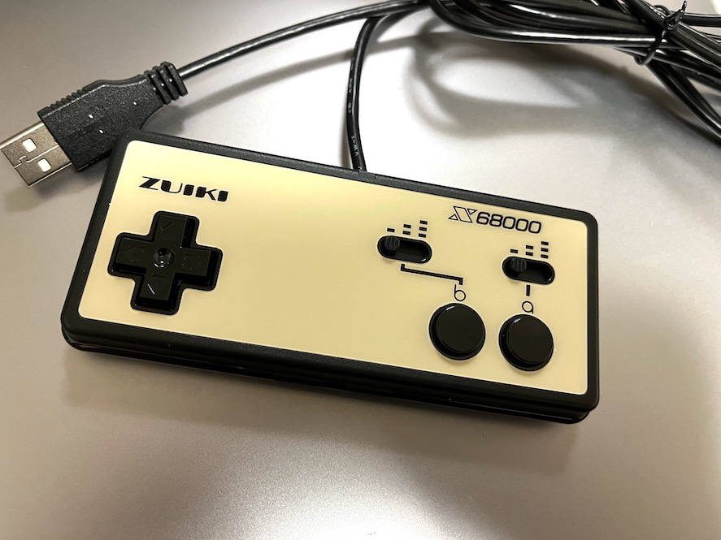
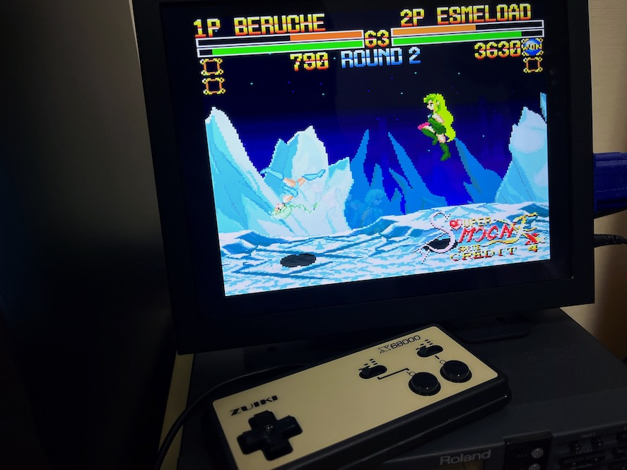
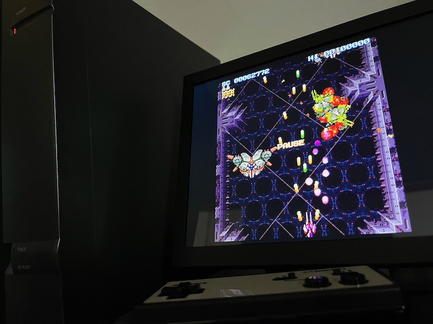
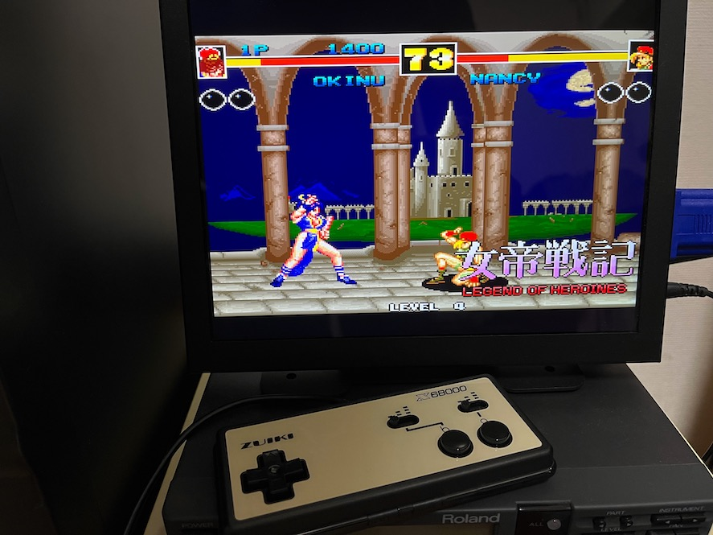
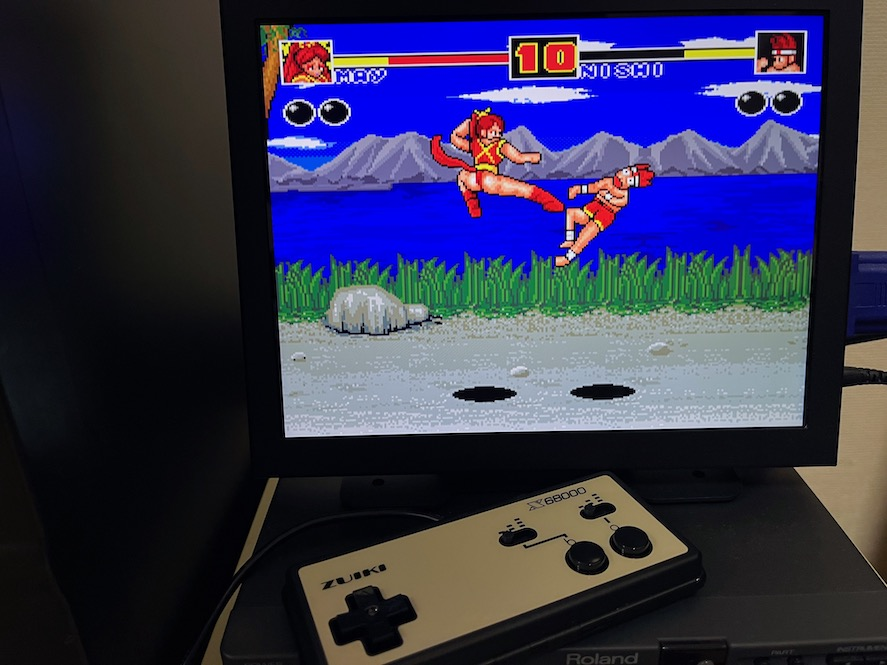

# nereid-usb-zuiki-joycard

ZUIKI X68000 Z JOYCARD を X680x0 実機 + Nereid USB で使う覚書

---

## はじめに

この覚書は ZUIKI社より単独販売および X68000 Z PRODUCT EDITION に標準装備されている X68000 Z JOYCARD (BLACK) を Nereid USB を使って X680x0 実機に繋ぐための覚書です。

---

## Nereidについて

Nereid は 68系サークル X-PowerStation (XPS) により開発された X680x0 複合拡張ボードです。
* イーサネットLANインターフェイス
* USBインターフェイス
* メインメモリ拡張
* バンクメモリ

などの多彩な機能を持っています。

---

## Nereid USB 端子へのジョイパッド接続

plastic氏 / あく蔵氏により開発された Nereid USB マウス・ジョイパッド用ドライバ USBJOY.X があります。
このドライバは定義ファイルによって任意のUSBジョイパッドを対応させる設計となっているのですが、ZUIKI X68000 Z JOYCARDの場合は `-x` オプション(Xbox360 コントローラモード)が必須となります。

 

usbjoy.def for ZUIKI X68000 Z JOYCARD
* [usbjoy-z2.zip](https://github.com/tantanGH/nereid-usb-zuiki-joycard/raw/main/usbjoy-z2.zip)

 

現在使っている usbjoy.def をバックアップした上で、ダウンロードした usbjoy.def と置き換えます。さらに常駐時に `-x` オプションを指定することで ZUIKI X68000 Z JOYCARD を認識させることができます。USBJOY.X は最新の 1.3e でのみ確認しています。

なお、利用できるのは十字キーとb,aボタンおよびL,Rボタンです。START/SELECTボタンは対応していません。L,Rボタンは連射なしのb,aボタンの扱いになります。

また、`-c` モードを使う場合は `-x` と同時に指定してください。

---

## ゲームソフトでの利用 (パッチ不要・ドライバ組み込みのみで対応できるもの)

元々 IOCS _JOYGET コールを使ってジョイスティックの読み取りを行なっているソフトであれば、そのまま利用できます。

* Super Moon Fighter X
* 超連射68K

など

 

 

超連射68Kの場合は、最新の1.10のXDFをダウンロードし、SYSディレクトリに USBJOY.X と USBJOY.DEF をコピーします。AUTOEXEC.BATの先頭に USBJOY.X -z を入れておけばokです。

---

## ゲームソフトでの利用 (パッチ必要・ドライバ組み込みのみでは対応できないもの)

IOCSを使わず直接8255のレジスタ($e9a001)を読んでいるソフトの場合は敢えてIOCS _JOYGETを使うようにパッチを当てる必要があります。IOCSコールが返す値は8255ポートの内容そのものですので、それほど難しいパッチではありません。

* 女帝戦記シリーズ
* 外道烈伝

など

参考までに女帝戦記1,2,3用の差分パッチを置いておきます。
* [JYOTEI_V1_USB.LZH](https://github.com/tantanGH/nereid-usb-zuiki-joycard/raw/main/JYOTEI_V1_USB.LZH)
* [JYOTEI_V2_USB.LZH](https://github.com/tantanGH/nereid-usb-zuiki-joycard/raw/main/JYOTEI_V2_USB.LZH)
* [JYOTEI_V3_USB.LZH](https://github.com/tantanGH/nereid-usb-zuiki-joycard/raw/main/JYOTEI_V3_USB.LZH)

オリジナルの JYOTEI.X がLZX圧縮されている場合は一度 `lzx -d` で展開したバイナリに対して `bup` でパッチしてください。なお、購入した時期によって JYOTEI.X の内容が異なりパッチが当たらない可能性はあります。また、厳密に検証したわけでもありません。

 

外道烈伝もパッチが必要になります。
* [GEDOU_USB.LZH](https://github.com/tantanGH/nereid-usb-zuiki-joycard/raw/main/GEDOU_USB.LZH)

---

## 更新履歴

- 2023.10.09 ... オリジナルの-xオプションでも動作するようなので、定義ファイルのみの提供とした
- 2023.10.07 ... 超連射68Kについて追記
- 2023.10.05 ... 外道烈伝のパッチを置いた
- 2023.10.05 ... 女帝戦記1,2,3用のパッチを置いた
- 2023.10.05 ... 初版