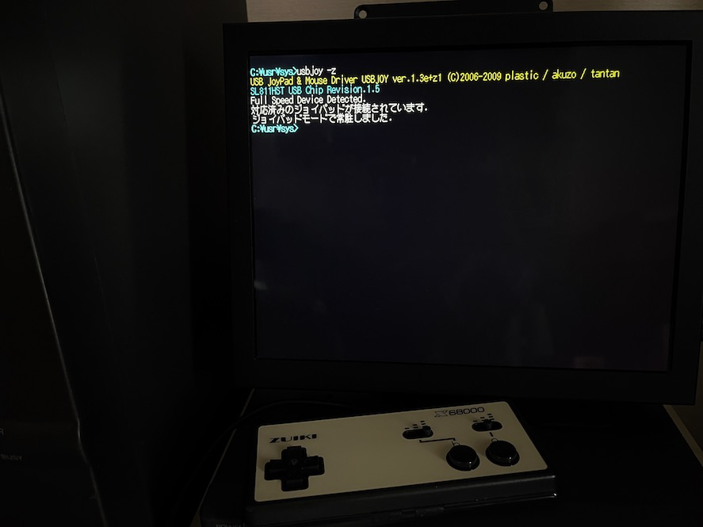

# nereid-usb-zuiki-joycard

ZUIKI X68000 Z JOYCARD を X680x0 実機 + Nereid USB で使う覚書

---

## はじめに

この覚書は ZUIKI社より単独販売および X68000 Z PRODUCT EDITION に標準装備されている X68000 Z JOYCARD (BLACK) を Nereid USB を使って X680x0 実機に繋ぐための覚書です。

---

## Nereidについて

Nereid は 68系サークル X-PowerStation (XPS) により開発された X680x0 複合拡張ボードです。
* イーサネットLANインターフェイス
* USBインターフェイス
* メインメモリ拡張
* バンクメモリ

などの多彩な機能を持っています。

---

## Nereid USB 端子へのジョイパッド接続

Plastic氏 / あく蔵氏により開発された Nereid USB マウス・ジョイパッド用ドライバ USBJOY.X があります。
このドライバは定義ファイルによって任意のUSBジョイパッドを対応させる設計となっているのですが、残念ながらZUIKI X68000 Z JOYCARDは定義ファイルだけでは対応しきれませんでした。このためやむを得ずドライバ本体を一部改変させて頂きました。

USBJOY.X ver.1.3e+z1 
* [USBJOY13EZ1.LZH](https://github.com/tantanGH/nereid-usb-zuiki-joycard/raw/main/USBJOY13EZ1.LZH)

現在使っている usbjoy.x および usbjoy.def をバックアップした上で、この改変版の usbjoy.x / usbjoy.def と置き換えます。さらに常駐時に `-z` オプションを指定することで ZUIKI X68000 Z JOYCARD を認識させることができます。

---

## ゲームソフトでの利用

元々 IOCS _JOYGET コールを使ってジョイスティックの読み取りを行なっているソフトであれば、そのまま利用できます。(例：Super Moon Figher X)

 

IOCSを使わず直接8255のレジスタ($e9a001,$e9a003)を読んでいるソフトの場合は敢えてIOCS _JOYGETを使うようにパッチを当てる必要があります。IOCSコールが返す値は8255ポートA,Bの内容そのものですので、それほど難しいパッチではありません。(例：女帝戦記)

---

## 更新履歴

2023.10.05 ... 初版